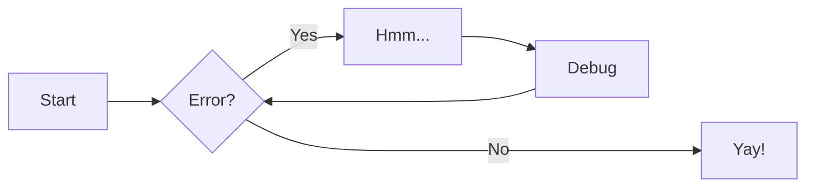

hide: - navigation in index.md

# Welcome to Info-Maths

Site du [lycée de Cornouaille](https://lycee-de-cornouaille-quimper.ac-rennes.fr){target=\_blank} ([académie de Rennes](https://www.ac-rennes.fr){target=\_blank}) pour l’enseignement de la spécialité NSI et de Mathématiques.

Accès direct:

[NSI en première](premiere/index.md){ .md-button .md-button--primary }

[NSI en terminale](terminales/index.md){ .md-button .md-button--primary }

[Spé mathématiques en terminale](maths/expo-premiere.md){ .md-button .md-button--primary }

[Ressources diverses](ressources/conda.md){ .md-button .md-button--primary }

!!! savoir "À savoir"

    :fontawesome-regular-hand-spock: l'informatique c'est sympa :fontawesome-regular-face-laugh-wink:

    :octicons-heart-fill-24:{ .heart }
    :octicons-heart-fill-24:{ .heart }
    :octicons-heart-fill-24:{ .heart }

!!! done "Les maths c'est sympa aussi :material-ufo-outline:{ .ufo }"

    En 1735, Leonhard Euler résout le **problème de Bâle** en établissant la formule suivante :

    $$\sum\limits_{k\in\mathbb N^*} \frac 1 {k^2} = \frac {\pi^2}6$$

    Cependant, il ne démontrera rigoureusement son résultat qu’en 1741.

Ce site et tout son contenu sont sous la licence

This work is licensed under a &nbsp;<a rel="license" href="http://creativecommons.org/licenses/by/4.0/">Creative Commons Attribution 4.0 International License</a>

