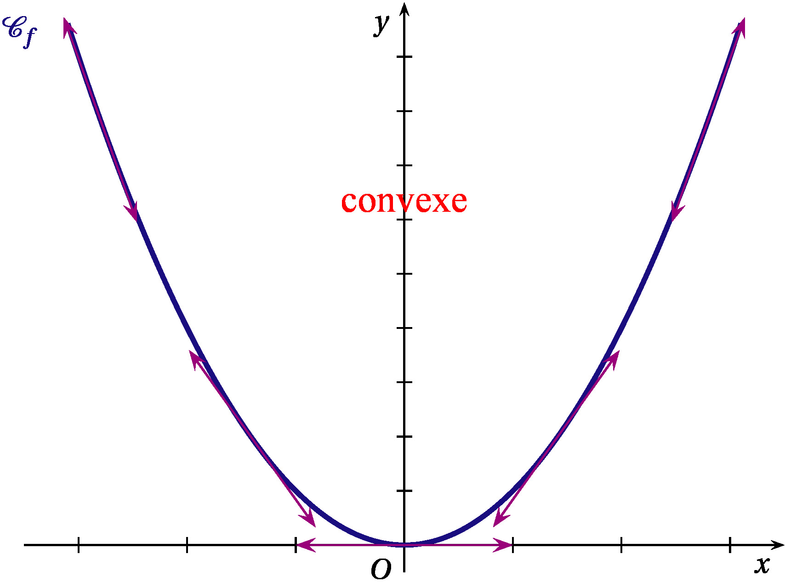
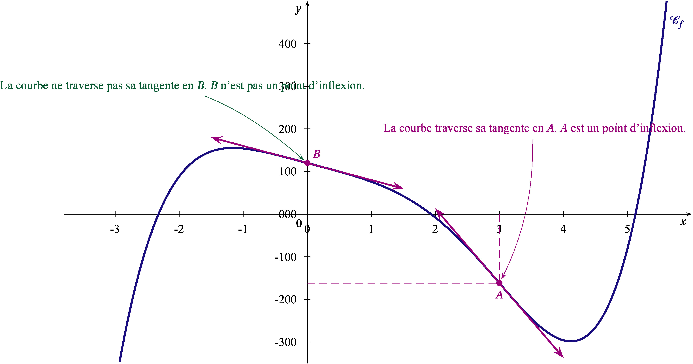

## Dérivées des fonctions composées

### Cas général

!!!tip "Propriété "

    Soient $u$ une fonction définie et dérivable sur un intervalle $I$ et à
    valeurs dans un intervalle $J$, et $v$ une fonction définie et dérivable
    sur $J$.

    Alors la fonction $v \circ u$ est dérivable sur $I$ et, pour tout réel
    $x \in I$, on a:

    $(v \circ u)'(x)=u'(x) \times (v' \circ u)(x)$.

### Applications à quelques fonctions

Dans cette partie, $u$ désigne une fonction et $I$ un intervalle.

!!!tip "Propriété Dérivée de $\boldsymbol{\sqrt{u}}$"

    Si $u$ est dérivable et strictement positive sur $I$, alors $\sqrt{u}$
    est dérivable sur $I$ et:

    $\left(\sqrt u\right)'=\dfrac{u'}{2\sqrt{u}}$.

!!!note "Preuve "

    Soit un réel $a\in I$ et un réel $h>0$ tel que $a+h$ soit dans $I$.

    On calcule le taux d'accroissement de $\sqrt{u}$ entre $a$ et $a+h$.

    $\dfrac{\sqrt{u(a+h)}-\sqrt{u(a)}}{h}=\dfrac{u(a+h)-u(a)}{h\left(\sqrt{u(a+h)}+\sqrt{u(a)}\right)} = \dfrac{u(a+h)-u(a)}{h} \times \dfrac{1}{\sqrt{u(a+h)}+\sqrt{u(a)}}$.

    Or, la fonction $u$ est dérivable sur $I$ donc
    $\lim_{h\to0}\dfrac{u(a+h)-u(a)}{h}=u'(a)$.

    D'où
    $\lim_{h\to0}\dfrac{\sqrt{u(a+h)}-\sqrt{u(a)}}{h}= u'(a) \times \dfrac{1}{2\sqrt{u(a)}}=\dfrac{u'(a)}{2\sqrt{u(a)}}$.

!!!example "Exemple "

    1.  $f(x) = \sqrt{x^2-x-2}$.

    2.  $g(x)=x \sqrt{x^2+1}$

**Correction**

1.  $f$ est du type $\sqrt{u}$ avec $u(x)=x^2-x-2$.

    Or, $u(x)$ est un trinôme de degré 2 ayant deux racines : $-1$ et
    $2$.

    Ainsi, $u(x)\geqslant0$ si $x\leqslant-1$ ou $x\geqslant2$ et $f$
    est définie sur $\mathcal{D}= ]-\infty~;~-1]\,\cup\,[2~;~+\infty[$.

    Et comme $f=\sqrt{u}$ est dérivable sur $\mathcal{D}$ sauf là où $u$
    s'annule alors $\mathcal{D}'= ]-\infty~;~-1[\,\cup\,]2~;~+\infty[$.
    On a $u'(x)=2x-1$ d'où
    $f'(x)=\dfrac{u'(x)}{2\sqrt{u(x)}}=\dfrac{2x-1}{2\sqrt{x^2-x-2}}$.

2.  $g$ est de la forme $u \times v$ , avec $u(x)=x \Rightarrow u'(x)=1$
    et
    $v(x)=\sqrt{x^2+1} \Rightarrow v'(x)=\frac{2x}{2 \sqrt{x^2+1}}=\frac{x}{\sqrt{x^2+1}}$.

    $f$ est dérivable sur $\R$ comme produit de fonctions dérivables sur
    $\R$ et

    $f'(x)=1 \times \sqrt{x^2+1} +x \times \frac{x}{\sqrt{x^2+1}}=\frac{2x^2+1}{\sqrt{x^2+1}}$.

!!!tip "Propriété Dérivée de $\boldsymbol{u^n}$ et $\boldsymbol{u^{-n}}$ "

    Soit $n\in\mathbb{N}^*$. Si $u$ est dérivable sur $I$ alors :

    -   La fonction $u^n$ est dérivable sur $I$ et $(u^n)'=nu'u^{n-1}$.

    -   La fonction $u^{-n}$ est dérivable sur $I$ sauf là où $u$ s'annule
        et $\left(u^{-n}\right)'=-nu'u^{-n-1}$.

!!!note "Preuve "

    -   On démontre par récurrence. Voici l'initialisation et l'hérédité :

        $\left(u^1\right)'=u'=1 \times u'u^{1-1}$. La proposition est donc
        initialisée au rang 1.

        Supposons qu'il existe un entier $k\in \mathbb{N^{*}}$ tel que la
        propriété « $\left(u^k\right)'=ku'u^{k-1}$ » soit vraie.

        $\left(u^{k+1}\right)'=\left(u^ku\right)'=\left(u^k\right)'u+u^ku'=ku'u^{k-1}u+u^ku'=(k+1)u'u^k$.

        La propriété est encore vraie au rang suivant donc elle est
        héréditaire.

    -   Si $u$ est dérivable sur $I$, alors $\dfrac{1}{u}$ est dérivable sur
        $I$ sauf là où $u$ s'annule.

        $\left(u^{-n}\right)'=\left(\dfrac{1}{u^n}\right)'=\left[\left(\dfrac{1}{u}\right)^n\right]'=n\left(\dfrac{1}{u}\right)'\left(\dfrac{1}{u}\right)^{n-1}$
        d'après la première propriété.

        Ainsi :
        $\left(u^{-n}\right)'=n\left(-\dfrac{u'}{u^2}\right)\dfrac{1}{u^{n-1}}=-\dfrac{nu'}{u^{n+1}}=-nu'u^{-n-1}$.

!!!example "Exemple "

    1.  $f(x) = (2x-3)^{5}$

    2.  $f(x) = \left(\dfrac{3x-1}{2x-4}\right)^2$

    3.  $f(x) = \dfrac{1}{\left(\sqrt{x}-1\right)^3}$

**Correction**

1.  On voit le type $u^5$. Voyons plutôt le type $u(ax+b)$ avec
    $u(x)=x^5$, $a=2$ et $b=-3$.

    Il est évident que $\mathcal{D}=\mathcal{D}'=\mathbb{R}$ vu que $f$
    est une fonction polynôme de degré 5 !

    On a $u'(x)=5x^4$ d'où
    $f'(x)=au'(ax+b)=2u'(2x-3)=2\times5\left(2x-3\right)^4=10\left(2x-3\right)^4$.

2.  $f$ est du type $u^2$ avec $u(x)=\dfrac{3x-1}{2x-4}$.

    Or, $u$ est définie sur $\mathbb{R}\setminus\{2\}$ donc $f$ est
    définie sur $\mathcal{D}=\mathbb{R}\setminus\{2\}$.

    $f$ est dérivable sur son ensemble de définition donc
    $\mathcal{D}'=\mathcal{D}$.

    On a
    $u'(x)=\dfrac{3(2x-4)-2(3x-1)}{\left(2x-4\right)^2}=\dfrac{-10}{\left(2x-4\right)^2}$.

    D'où,
    $f'(x)=2u'(x)u^{2-1}(x)=2u'(x)u(x)=2\times\dfrac{-10}{\left(2x-4\right)^2}\times\dfrac{3x-1}{2x-4}=-\dfrac{20(3x-1)}{\left(2x-4\right)^3}$.

3.  $f(x)=\left(\sqrt{x}-1\right)^{-3}$ est du type $u^{-3}$ avec
    $u(x)=\sqrt{x}-1$.

    Or, $u$ est définie sur $[0~;~+\infty[$ et $f$ aussi sauf là où $u$
    s'annule. Donc, $\mathcal{D}=[0~;~1[\,\cup\,]1~;~+\infty[$.

    La fonction $x\mapsto\sqrt{x}$ n'est pas dérivable en 0 donc $u$ et
    $f$ aussi. Ainsi, $\mathcal{D}'=]0~;~1[\,\cup\,]1~;~+\infty[$.

    On a $u'(x)=\dfrac{1}{2\sqrt{x}}$ d'où
    $f'(x)=-3u'(x)u^{-3-1}(x)=-3u'(x)u^{-4}(x)=-\dfrac{3}{2\sqrt{x}\left(\sqrt{x}-1\right)^4}$.

!!!tip "Propriété Dérivée de $^u$"

    Soit $u$ une fonction définie et dérivable sur un intervalle $I$. La
    fonction $^u$ est dérivable sur $I$ et
    $\left( ^u \right) ' =u' \times ^u$

!!!example "Exemple "

    1.  $f(x)= ^{-x}$.

    2.  $g(x)=^{0,5x^2-2x+1}$.

    3.  $h(x)= x ^{x^2}$.

**Correction**

1.  Pour tout réel $x$, on pose $u(x)=-x$. $u$ est dérivable sur $\R$ et
    $u'(x)=-1$.

    Donc $f$ est dérivable sur $\R$ et $f'(x) =  -^{-x}$.

2.  Pour tout réel $x$, posons $u(x)=0,5x^2-2x+1$. $u$ est dérivable sur
    $\R$ et $u'(x)=x-2$.

    Donc $f$ est dérivable sur $\R$ et $f'(x) =  (x-2) ^{0,5x^2-2x+1}$.

3.  $f$ est de la forme $u \times v$ , avec $u(x)=x \Rightarrow u'(x)=1$
    et $v(x)=^{x^2} \Rightarrow v'(x)=2x ^{x^2}$.

    $f$ est dérivable sur $\R$ comme produit de fonctions dérivables sur
    $\R$ et

    $f'(x)=1 \times ^{x^2}+x \times 2x ^{x^2}=^{x^2} \left(1+2x^2 \right)$.

## Convexité

### Fonction convexe, Fonction concave

#### Définitions

!!!tip "Définition "

    Soit $f$ une fonction dérivable sur un intervalle $I$ et $\mathcal{C}_f$
    sa courbe représentative.

    -   Dire que la fonction $f$ est convexe sur $I$ signifie que la courbe
        $\mathcal{C}_f$ est située entièrement au-dessus de chacune de ses
        tangentes.

    -   Dire que la fonction $f$ est concave sur $I$ signifie que la courbe
        $\mathcal{C}_f$ est située entièrement au-dessous de chacune de ses
        tangentes.

!!!example "Exemples "

      La fonction carré $x \longmapsto x^2$ est  convexe.

    

     La fonction inverse $x \longmapsto \dfrac{1}{x}$ est concave sur $]-\infty;0[$  et convexe sur $]0;+\infty[$

    

!!!note "Remarque "

    Intuitivement, quels que soient les points $A$ et $B$ de la courbe
    $\mathcal{C}_f$

    -   Si le segment $[AB]$ est au-dessus de la courbe alors $f$ est
        convexe.

    -   Si le segment $[AB]$ est au-dessous de la courbe alors $f$ est
        concave.

#### Convexité et fonctions dérivées

!!!tip "Théorème "

    Soit $f$ une fonction définie et dérivable sur un intervalle $I$.

    -   $f$ est convexe sur $I$ si, et seulement si, sa fonction dérivée
        $f'$ est croissante sur $I$.

    -   $f$ est concave sur $I$ si, et seulement si, sa fonction dérivée
        $f'$ est décroissante sur $I$.

!!!tip "Théorème "

    On note $f''$ la dérivée seconde de la fonction $f$, c'est à dire la
    dérivée de la dérivée $f'$.

    -   Si la dérivée seconde est positive alors la fonction $f$ est
        convexe.

    -   Si la dérivée seconde est négative alors la fonction $f$ est
        concave.

!!!note "Preuve "

    soit $f$ une fonction définie et deux fois dérivable sur un intervalle
    $I$ et $a$ un réel appartenant à $I$.

    $C_f$ est sa courbe représentative dasn un repère et $T$ est la tangente
    à $C_f$ au point d'abscisse $a$.

    On veut démontrer que : "Si $f''$ est positive, alors $f$ est convexe
    sur $I$". c'est-à-dire que sur $I$, $c_f$ est au-dessus de $T$.

    Supposons que, pour tout $x \in I$, $f''(x)>0$. Soit $g$ la fonction
    définie sur $I$ par :
    $g(x)=f(x)-(f'(a)(x-a)+f(a)) \iff g(x)= f(x) -f'(a)(x-a) -f(a)$.

    Comme $f$ est deux fois dérivable sur $I$, $g$ l'est aussi et on a :
    $g'(x)=f'(x)-f'(a)$ et $g''(x)=f''(x)$.

    Ainsi : $g''(x)>0$ et $g'$ est donc croissante sur $I$.

    -   Si $x<a$, alors on a $g'(x)<g'(a)$. Or, $g'(a)=0$, donc $g'(x)<0$.

        Donc $g$ est décroissante, donc $g(x)>g(a)$.

        Or $g(a)=0$, donc $g(x)>0$.

        Donc $C_f$ est au-dessus de $T$.

    -   Si $x>a$, alors on a $g'(x)>g'(a)$. Or, $g'(a)=0$, donc $g'(x)>0$.

        Donc $g$ est croissante, donc $g(x)>g(a)$.

        Or $g(a)=0$, donc $g(x)>0$.

        Donc $C_f$ est au-dessus de $T$.

    Dans les deux cas, $C_f$ est au-dessus de $T$, donc la fonction $f$ est
    convexe.

!!!example "Exemple "

    Soit $f$ la fonction définie sur $\R$ par $f(x)=x^5-5x^4$.

    Sa dérivée est la fonction $f'$ définie sur $\R$ par $f'(x)=5x^4-20x^3$.

    Sa dérivée seconde est la fonction $f''$ définie sur $\R$ par
    $f''(x)=20x^3-60x^2=20x^2(x-3)$.

    Les variations de $f'$ se déduisent du signe de sa dérivée $f''$.

    Notons que $20x^2 \geqslant 0$ donc $f''(x)$ est du même signe que
    $x-3$. D'où le tableau :

    

    $f$ est concave sur $\left] -\infty ; 3 \right]$ et convexe sur
    $\left[ 3;+\infty  \right[$.

### Point d'inflexion

!!!tip "Définition "

    Soit $f$ une fonction définie et dérivable sur un intervalle $I$ et
    $\mathcal{C}_f$ sa courbe représentative.

    S'il existe un point $A$ de la courbe $\mathcal{C}_f$ tel que la courbe
    traverse sa tangente en ce point, alors on dit que $A$ est un point
    d'inflexion.

!!!tip "Propriété "

    -   En un point d'inflexion la courbe traverse sa tangente : cela
        signifie que la fonction change de convexité.

    -   Si la dérivée $f'$ change de sens de variation en $a$ alors la
        courbe admet un point d'inflexion d'abscisse $a$.

    -   Si la dérivée seconde $f''$ s'annule en changeant de signe en $a$
        alors la courbe admet un point d'inflexion d'abscisse $a$.

!!!example "Exemple "

    Soit $f$ la fonction définie sur $\R$ par $f(x)=x^5-5x^4-40x+120$ et
    $\mathcal{C}_f$ sa courbe représentative.

    Sa dérivée est la fonction $f'$ définie sur $\R$ par
    $f'(x)=5x^4-20x^3-40$.

    Sa dérivée seconde est la fonction $f''$ définie sur $\R$ par
    $f''(x)=20x^2(x-3)$.

    L'équation $f''(x)=0$ admet deux solutions $x_1=0$ et $x_2=3$.

    Notons que $20x^2 \geqslant 0$ donc $f''(x)$ est du même signe que
    $x-3$.

    Les variations de $f'$ se déduisent du signe de sa dérivée $f''$. D'où
    le tableau :

    

    En tenant compte des changements de variation de la dérivée $f'$ on en
    déduit que la courbe $\mathcal{C}_f$ admet un seul point d'inflexion, le
    point $A \left( 3 ; f(3) \right)$.

    En effet :

    -   $f''(0)=0$ mais, sur l'intervalle $]-\infty ; 3]$
        $f''(x) \leqslant 0$ donc le point $B \left( 0 ; 120 \right)$ de la
        courbe $\mathcal{C}_f$ d'abscisse 0, n'est pas un point d'inflexion.
        (La fonction $f$ est concave sur $]-\infty ; 3]$).

    -   $f''$ s'annule en 3 en changeant de signe donc le point
        $A \left( 3 ; -162 \right)$ est un point d'inflexion de la courbe
        $\mathcal{C}_f$. (La fonction $f$ est concave sur $]-\infty ; 3]$ et
        convexe sur $[3 ;+\infty [$).

