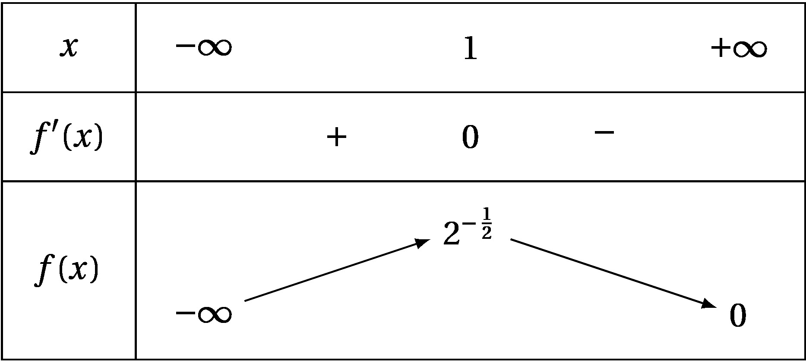

## Exercice 1: /5 points

\*Cet exercice est un QCM (questionnaire à choix multiples). Pour chacune
des questions posées, une seule des quatre réponses proposées est
exacte. Indiquer sur la copie le numéro de la question et recopier la
lettre de la réponse choisie.

Aucune justification n'est demandée.

Une réponse exacte rapporte $1$ point; une réponse fausse, une réponse
multiple ou l'absence de réponse ne rapporte ni n'enlève de point.\*

1.  Dans une station de sport d'hiver, une étude statistique a établi
    qu'un client sur quatre pratique le surf.

    Dans une télécabine accueillant $80$ clients de la station, la
    probabilité arrondie au millième qu'il y ait exactement $20$ clients
    pratiquant le surf est :

    ***

    **a.  ** 0,103 **b.  ** 0,25 **c.  **1 **d.  **0,560

    ***

    ???tip "Solution"

        Réponse a : $0,103$. Calcul de la probabilité avec la loi binomiale
        de paramètres $n=80$, $p=0,25$ et $k=20$.

2.  Pour la recherche d'un emploi, une personne envoie sa candidature à
    $25$ entreprises. La probabilité qu'une entreprise lui réponde est
    de $0,2$ et on suppose que ces réponses sont indépendantes.

    La probabilité, arrondie au millième, que la personne reçoive moins
    de $5$ réponses est :

    ***

    **a.  **0,200 **b.  **0,187 **c.  **0,617 **d.  **0,421

    ***

    ???tip "Solution"

        Réponse d : $0,421$. Calcul de la probabilité cumulée avec la loi
        binomiale de paramètres $n=25$, $p=0,2$ et $k=4$.

3.  $f$ est la fonction définie sur $\R$ par $f(x)=xe^{2x}$. La fonction
    $f$ admet pour dérivée la fonction $f'$ définie sur $\R$ par :

    ***

    **a.  **$f'(x)=e^{2x}$ **b.  **$f'(x)=2xe^{2x}$ **c.  **$f'(x)=(1+2x)e^{2x}$ **d.  **$f'(x)=(1+x)e^{2x}$

    ***

    ???tip "Solution"

        Réponse c : $f'(x)=(1+2x)e^{2x}$. $f=u \times v$, avec
        $u=x \Rightarrow u'=1$ et $v=e^{2x} \Rightarrow v'=2 e^{2x}$

4.  $f$ est la fonction définie sur $\R$ par $f(x)=(e^{-x}+1)^3$. La
    fonction $f$ admet pour dérivée la fonction $f'$ définie sur $\R$
    par :

    ***

    **a.  **$f'(x)=-3e^{-x}(e^{-x}+1)^2$ **b.  **$f'(x)=3e^{-x}(e^{-x}+1)^2$ **c.  **$f'(x)=3(e^{-x})^2(e^{-x}+1)$ **d.  **$f'(x)=-3(e^{-x}+1)^2$

    ***

    ???tip "Solution"

        Réponse a : $f'(x)=-3e^{-x}(e^{-x}+1)^2$. $f=u^3$ avec
        $u=e^{-x}+1 \Rightarrow u'=-e^{-x}$.

5.  Soit $f$ une fonction deux fois dérivable sur l'intervalle $[-2;3]$.
    On note $f'$ sa dérivée.

    La courbe représentative de la fonction dérivée notée
    $\mathcal{C}_{f'}$ est donnée ci dessous.

    

    La fonction $f$ est :

    ***

    **a.  **convexe sur $[-2;0,5]$ **b.  **convexe sur $[0,5;3]$ **c.  **concave sur $[-1;2]$ **d.  **concave sur $[-2;0,5]$

    ***

    ???tip "Solution"

        Réponse c : concave sur $[-1;2]$. $f'$ est croissante sur
        $[-2;-1] \cup [2;3]$, donc $f$ est convexe sur cet intervalle. $f'$
        est décroissante sur $[-1;2]$, donc $f$ est concave sur cet
        intervalle.

## exercice Exercice 2: /7 points

**Dans cet exercice, les résultats approchés seront donnés à
$0,0001$  près.**

Lors d'une épidémie chez des bovins, on s'est aperçu que si la maladie
est diagnostiquée suffisamment tôt chez un animal, on peut le guérir ;
sinon la maladie est mortelle.

Un test est mis au point et essayé sur un échantillon d'animaux dont 1 %
est porteur de la maladie.

On obtient les résultats suivants :

- si un animal est porteur de la maladie, le test est positif dans
  85 % des cas ;

- si un animal est sain, le test est négatif dans 95 % des cas.

On choisit de prendre ces fréquences observées comme probabilités pour
la population entière et d'utiliser le test pour un dépistage préventif
de la maladie.

On note :

: M l'évènement : `\og `{=latex}l'animal est porteur de la maladie
`\fg{}`{=latex} ;

: T l'évènement : `\og `{=latex}le test est positif `\fg`{=latex}.

1.  Construire un arbre pondéré modélisant la situation proposée.
    `\setbar{0.5}`{=latex}

    ???tip "Solution"

    Aucun problème

2.  Un animal est choisi au hasard.

    1.  Quelle est la probabilité qu'il soit porteur de la maladie et
        que son test soit positif ?

        ???tip "Solution"

            On suit la première branche :
            $p(M \cap T) = p(M) \times p_{M}(T) = 0,01 \times 0,85 = 0,0085$.

    2.  Montrer que la probabilité pour que son test soit positif est
        $0,058$.

        ???tip "Solution"

            $M$ et $\overline{M}$ forment une partition de l'univers,
            d'après la formule des probabilités totales, on a :\
            $p(T) = p(M \cap T)+p(\overline{M} \cap T)$\
            $p(T) = p(M) \times p_{M}(T) + p\left(\overline{M}\right) \times p_{\overline{M}}(T)$\
            $p(T)= 0,0085 + 0,99 \times 0,05 = 0,058$.

3.  Un animal est choisi au hasard parmi ceux dont le test est positif.

    Quelle est la probabilité pour qu'il soit porteur de la maladie ?

    ???tip "Solution"

        $p_{T}(M) = \dfrac{p(M \cap T)}{p(T)} = \dfrac{0,0085}{0,058} \approx 0,1466$.

4.  On choisit cinq animaux au hasard. La taille de ce troupeau permet
    de considérer les épreuves comme indépendantes et d'assimiler les
    tirages à des tirages avec remise. On note X la variable aléatoire
    qui, aux cinq animaux choisis, associe le nombre d'animaux ayant un
    test positif.

    1.  Quelle est la loi de probabilité suivie par X ? Justifier.

        ???tip "Solution"

            On assimile les tirages à des tirages avec remise. On répète
            donc 5 fois de manière indépendante une épreuve de Bernoulli
            donc la probabilité du succès ("l'animal est positif") est
            $0,058$. Donc $X$ suit une loi binomiale de paramètres $n = 5$
            et $p = 0,058$.

    2.  Quelle est la probabilité pour qu'au moins un des cinq animaux
        ait un test positif ?

        ???tip "Solution"

            $p(X \geq 1)=1-p(X=0)=1-\binom{5}{0} \times  0,058^0 \times (1 - 0,058)^{5}=1-0,942^5 \approx 0,2583$.

5.  Le coût des soins à prodiguer à un animal ayant réagi positivement
    au test est de 100 euros et le coût de l'abattage d'un animal non
    dépisté par le test et ayant développé la maladie est de 1000 euros.
    On suppose que le test est gratuit.

    On appelle $Y$ la variable donnant le coût à engager par animal
    subissant le test.

    1.  Donner dans un tableau la loi de probabilité de la variable
        aléatoire $Y$.

        ???tip "Solution"

        `\centering `{=latex}`\arraybackslash`{=latex}$y_{i}$ `\centering `{=latex}`\arraybackslash`{=latex} $0$ `\centering `{=latex}`\arraybackslash`{=latex} `\centering `{=latex}`\arraybackslash`{=latex} `\centering `{=latex}`\arraybackslash`{=latex} `\centering `{=latex}`\arraybackslash`{=latex} `\centering `{=latex}`\arraybackslash`{=latex} `\centering `{=latex}`\arraybackslash`{=latex} `\centering `{=latex}`\arraybackslash`{=latex} `\centering `{=latex}`\arraybackslash`{=latex} `\centering `{=latex}`\arraybackslash`{=latex} `\centering `{=latex}`\arraybackslash`{=latex}

        ***

        `\centering `{=latex}`\arraybackslash`{=latex}$p(Y=y_{i}$ `\centering `{=latex}`\arraybackslash`{=latex},9405 `\centering `{=latex}`\arraybackslash`{=latex},058 `\centering `{=latex}`\arraybackslash`{=latex},0015 `\centering `{=latex}`\arraybackslash`{=latex} `\centering `{=latex}`\arraybackslash`{=latex} `\centering `{=latex}`\arraybackslash`{=latex} `\centering `{=latex}`\arraybackslash`{=latex} `\centering `{=latex}`\arraybackslash`{=latex} `\centering `{=latex}`\arraybackslash`{=latex} `\centering `{=latex}`\arraybackslash`{=latex} `\centering `{=latex}`\arraybackslash`{=latex}

    2.  Calculer l'espérance mathématique de la variable aléatoire $Y$.

        ???tip "Solution"

            $E(Y)= 0 \times 0,9405 + 100 \times 0,0580 + 1000 \times 0,0015 = 5,80 + 1,50 = 7,30$ €.

    3.  Un éleveur possède un troupeau de 200 bêtes. Si tout le troupeau
        est soumis au test, quelle somme doit-il prévoir d'engager ?

        ???tip "Solution"

            Le coût moyen par animal est $7,30$ €. Pour 200 bêtes, le coût
            sera en moyenne de : $200 \times 7,30 = 1460$ €.

## exercice Exercice 3: /8 points

$f$ est la fonction définie sur $\R$ par :
$f(x)=(x + 1)^{-\frac{1}{2}x}$.

1.  Calculer la limite de la fonction $f$ en $-\infty$.

    ???tip "Solution"

        $\displaystyle\left.
        \begin{array}{l}
        \displaystyle\lim*{x \to -\infty} -\frac{1}{2}x=+\infty\\
        \displaystyle\lim*{x \to +\infty} e^x =+\infty
        \end{array}
        \right\}$

        Par composée :
        $\displaystyle\lim_{x \to -\infty} ^{-\frac{1}{2}x}= +\infty$.

        $\displaystyle\lim_{x \to -\infty} x+1=-\infty$. Donc par produit :

        $\displaystyle\lim_{x \to -\infty} f(x)= -\infty$.

2.  1.  Justifier que, pour tout réel $x$,
        $f(x) = 2\left(\dfrac{\frac{1}{2}x}{^{\frac{1}{2}x}}\right) + ^{- \frac{1}{2}x}$.
        `\setbar{1}`{=latex}

        ???tip "Solution"

            $f(x) = (x + 1)^{-\frac{1}{2}x} = x ^{-\frac{1}{2}x} + ^{-\frac{1}{2}x} = \dfrac{x}{^{\frac{1}{2}x}} + ^{-\frac{1}{2}x}
            = \dfrac{2\frac{1}{2}x}{^{\frac{1}{2}x}} + ^{-\frac{1}{2}x} = 2\left(\dfrac{\frac{1}{2}x}{^{\frac{1}{2}x}}\right) + ^{- \frac{1}{2}x}$

    2.  En déduire la limite de la fonction $f$ en $+\infty$.
        Interpréter graphiquement ce résultat. `\setbar{1.5}`{=latex}

        ???tip "Solution"

            On sait que
            $\displaystyle\lim_{X\to +\infty} \dfrac{^{X}}{X} = +\infty$
            donc $\displaystyle\lim_{X\to +\infty} \dfrac{X}{^{X}} = 0$.

            On pose $X=\dfrac{1}{2}x$;
            $\displaystyle\lim_{x\to +\infty} X = +\infty$. Par le théorème
            de croissance comparée, on a donc
            $\displaystyle\lim_{x\to +\infty} \dfrac{\frac{1}{2}x}{^{\frac{1}{2}x}} = 0$.

            On sait que $\displaystyle\lim_{X\to +\infty} ^{-X} =0$.

            On pose $X=\dfrac{1}{2}x$;
            $\displaystyle\lim_{x\to +\infty} X = +\infty$. On peut donc
            dire que
            $\displaystyle\lim_{x\to +\infty} ^{-\frac{1}{2}x} = 0$.\
            Par produit, on peut donc déduire que
            $\displaystyle\lim_{x\to +\infty}f(x) = 0$.\
            Interprétation graphique : la courbe représentative de la
            fonction $f$ admet une asymptote horizontale en $+\infty$ : la
            droite d'équation $y=0$ (l'axe des abscisses).

3.  Étudier les variations de la fonction $f$ sur $\R$ et dresser son
    tableau de variations. `\setbar{1.5}`{=latex}

    ???tip "Solution"

        $f=u \times v$, avec $u=x+1 \Rightarrow u'=1$ et
        $v=^{-\frac{1}{2}x} \Rightarrow v'=-\dfrac{1}{2}^{-\frac{1}{2}x}$.
        On obtient :
        $f'(x)=\left (-\dfrac{1}{2}x +\dfrac{1}{2}\right )^{-\frac{1}{2}x}$

        Or, pour tout réel $x$, $^{-\frac{1}{2}x}>0$ donc $f'(x)$ est du
        signe de $-\dfrac{1}{2}x +\dfrac{1}{2}$ qui s'annule et change de
        signe pour $x=1$.

        On établit le tableau des variations de $f$ sur $\R$:

        

4.  1.  Démontrer que l'équation $f(x) = 0,07$ admet une unique solution
        $\alpha$ sur l'intervalle $[1~;~ +\infty[$.
        `\setbar{0.5}`{=latex}

        ???tip "Solution"

        Sur $[1~;~+\infty[$, $f$ est continue, strictement décroissante.
        $f(1)=2^{-\frac{1}{2}}>0,07$ et
        $\displaystyle\lim_{x\to +\infty}f(x) = 0$. D'après le Théorème
        de Valeurs Intermédiaires, l'équation $f(x)=0,07$ admet une
        unique solution $\alpha \in [1~;~+\infty[$.

    2.  Donner l'arrondi de $\alpha$ au dixième près.
        `\setbar{0.5}`{=latex}

        ???tip "Solution"

        A la calculatrice : $f(10,13) \approx 0,0702$ et
        $f(10,14) \approx 0,0699$. Donc $\alpha \approx 10,1$.

5.  Etudier la convexité de la fonction $f$ et donner les coordonnées
    des éventuels points d'inflexion. `\setbar{2}`{=latex}

    ???tip "Solution"

    $f'=u \times v$, avec
    $u=-\dfrac{1}{2}x +\dfrac{1}{2} \Rightarrow u'=-\dfrac{1}{2}$ et
    $v==^{-\frac{1}{2}x} \Rightarrow v'=-\dfrac{1}{2}^{-\frac{1}{2}x}$.\
    On obtient :
    $f''(x)=\left (\dfrac{1}{4}x- \dfrac{3}{4}\right )^{-\frac{1}{2}x} = \frac{1}{4} ^{-\frac{1}{2}x} (x-3)$.\
    Pour tout réel $x$, $\frac{1}{4} ^{-\frac{1}{2}x}>0$, donc $f''(x)$
    est du signe de $x-3$.

    - Pour tout réel $x \leq 3$, $f''(x) \leq 0$, donc $f$ est concave
      sur $]-\infty ; 3]$.

    - Pour tout réel $x \geq 3$, $f''(x) \geq 0$, donc $f$ est convexe
      sur $[3;+\infty[$

    La fonction change de convexité en $3$, la courbe représentative de
    la fonction $f$ admet donc un point d'inflexion dont les coordonnées
    sont $( 3 ; f(3))$, soit $\left(3~;~4e^{-\frac{3}{2}}\right)$.

:::
